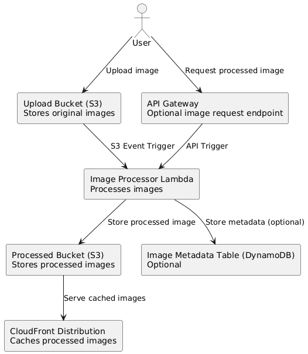

# Serverless Image Processing on AWS

## Project Overview
This project implements a **serverless image processing solution** using AWS services. Users can upload images to an S3 bucket, which triggers a Lambda function to resize and process the image. Processed images are stored in a dedicated S3 bucket and cached globally via CloudFront. Optionally, image metadata is stored in a DynamoDB table.

This solution demonstrates best practices for serverless architecture, event-driven workflows, and scalable infrastructure using AWS CloudFormation.

---

## Architecture Diagram


**Architecture Components:**
- **Upload Bucket (S3):** Users upload original images.
- **Processed Bucket (S3):** Stores processed images.
- **Lambda Function:** Processes images and stores metadata.
- **DynamoDB (Optional):** Stores image metadata.
- **API Gateway (Optional):** Exposes endpoints for image requests.
- **CloudFront Distribution:** Provides caching for processed images globally.

---

## Folder Structure

aws-serverless-image-processing/
│
├─ README.md
├─ architecture-diagram.png
├─ src/
│ └─ image_processor/
│ └─ app.py # Lambda function code
├─ templates/
│ └─ main.yaml # CloudFormation template
├─ deployment/ # Optional deployment scripts
│ └─ deploy.sh
├─ tests/ # Unit or integration tests
│ └─ test_lambda.py
├─ .gitignore
└─ LICENSE


---

## AWS Services Used
- **Amazon S3** – Upload and processed buckets.  
- **AWS Lambda** – Image processing function.  
- **Amazon DynamoDB (Optional)** – Metadata storage.  
- **Amazon API Gateway** – Optional REST API for image requests.  
- **Amazon CloudFront** – Caching layer for low latency and global access.  
- **IAM Roles** – Controls permissions for Lambda access to S3 and DynamoDB.  

---

## Deployment Instructions

1. **Upload Lambda Package**  
   - Zip your `src/image_processor/` folder containing `app.py`.  
   - Upload it to an S3 bucket (used in CloudFormation parameter `LambdaS3CodeBucket`).

2. **Deploy CloudFormation Stack**  
   - Go to AWS CloudFormation console.  
   - Create a new stack using `templates/main.yaml`.  
   - Provide parameters for:  
     - `LambdaS3CodeBucket` – S3 bucket containing your Lambda zip.  
     - `LambdaS3CodeKey` – S3 key for the Lambda zip file.

3. **Test S3 Trigger**  
   - Upload an image to the **Upload Bucket**.  
   - Lambda will process the image and store it in **Processed Bucket**.  

4. **Test API Gateway (Optional)**  
   - POST to the API Gateway endpoint with JSON:  
     ```json
     {
       "bucket": "upload-bucket-demo",
       "key": "example.png"
     }
     ```
   - Lambda will process and return processed image info.

5. **Access via CloudFront**  
   - Use the CloudFront distribution domain to access processed images globally with caching.

---

## Usage Notes
- Images are resized to **128x128 pixels** by default (adjustable in `app.py`).  
- Metadata is stored in DynamoDB (optional) with `id`, `original_file`, and `processed_file`.  
- CloudFront reduces latency and costs for repeated image access.  
- This architecture is fully serverless, scalable, and follows AWS best practices.
